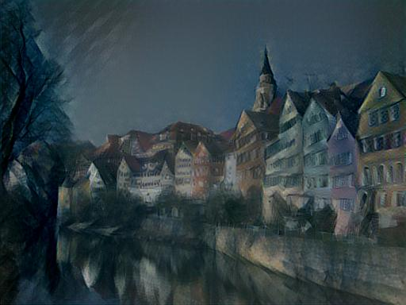

# StyleTransfer
Deep neural style transfer

###paper:
[A Neural Algorithm of Artistic Style](https://arxiv.org/abs/1508.06576) 
[Perceptual Losses for Real-Time Style Transfer and Super-Resolution](http://cs.stanford.edu/people/jcjohns/eccv16/)

###src:
**neural_style.lua:** 
Algorithm for paper: [A Neural Algorithm of Artistic Style](https://arxiv.org/abs/1508.06576) 
The code reference to [jcjohnson/neural-style](https://github.com/jcjohnson/neural-style), simplified

**neural_style_RealTime.lua:** 
Algorithm for paper: [Perceptual Losses for Real-Time Style Transfer and Super-Resolution](http://cs.stanford.edu/people/jcjohns/eccv16/) 
Model : [Supplementary](http://cs.stanford.edu/people/jcjohns/papers/eccv16/JohnsonECCV16Supplementary.pdf)

###Example result:

  
  
  

